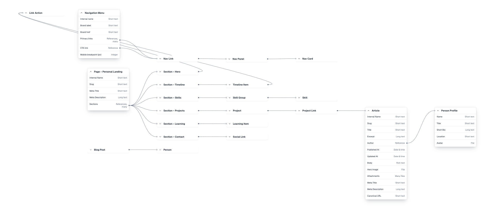
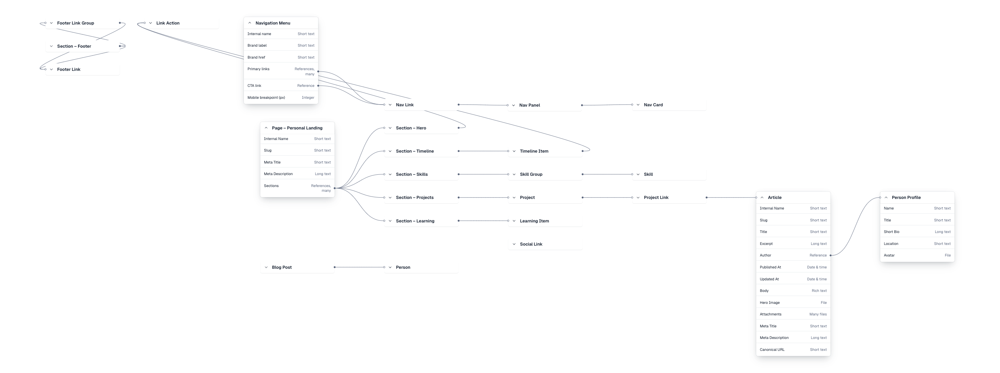

# Gilberto A. Haro — Content-Driven Frontend Architecture (React + TypeScript + Contentful)

## Table of Contents

- [Overview](#overview)
- [Canonical Sources](#canonical-sources)
- [Why This Project Matters](#why-this-project-matters)
- [Key Highlights](#key-highlights)
- [Tech Stack](#tech-stack)
- [Repository Structure](#repository-structure)
- [Architecture Summary](#architecture-summary)
- [Content Modeling / CMS Integration](#content-modeling--cms-integration)
- [Storybook / Design System](#storybook--design-system)
- [Testing / Quality](#testing--quality)
- [Local Development](#local-development)
- [Deployment (Netlify)](#deployment-netlify)
- [Notable Project Decisions](#notable-project-decisions)
- [SEO / Searchability Status](#seo--searchability-status)
- [Roadmap Status and Deferred Items](#roadmap-status-and-deferred-items)
- [Screenshots / Demo](#screenshots--demo)
- [Author](#author)

## Overview

This repository is a personal site and architecture-focused frontend project that demonstrates how to build a maintainable, content-rich React application with clear boundaries between UI, routing, CMS integration, and design-system primitives.

It currently powers:

- `/` for a modular, CMS-driven landing page
- `/articles` for article index rendering
- `/articles/:slug` for article detail pages
- `/debug` for Contentful model visibility checks
- `/debug/github` for GitHub service-layer validation (Phase 1 debug surface)

The project is designed to show practical frontend engineering patterns for teams working with Contentful, Storybook, and component systems over time.

Roadmap status:
- phases `0` through `7` are complete
- Roadmap v2 phases `A` through `F` are complete
- repository is in maintenance mode with Phase F workflow as the active quality baseline

## Canonical Sources

Use these docs as source-of-truth surfaces:

- **Architecture baseline:** `docs/planning/PHASE-0-BASELINE.md`
- **Canonical phase sequence:** `docs/planning/IMPLEMENTATION-ROADMAP.md`
- **Roadmap closeout + maintenance tracker:** `docs/planning/TASKS.md`
- **Phase history records:** `docs/planning/PHASE-*.md`
- **Final roadmap consolidation record:** `docs/planning/PHASE-7-TESTING-GOVERNANCE-DOCS.md`
- **Maintenance QA/release discipline record:** `docs/planning/PHASE-F-MAINTENANCE-QA-RELEASE-DISCIPLINE.md`
- **Design-system reference:** `docs/design-system/design-system.md`
- **Legacy planning history (non-canonical):** `docs/planning/ROADMAP.md`

## Why This Project Matters

Most CMS-backed frontends degrade when raw content shapes leak into components or when UI and content concerns are tightly coupled. This project focuses on avoiding that failure mode.

It demonstrates:

- a source abstraction that supports both Contentful and static fixtures
- typed adapters that map CMS entries into render-safe view models
- section normalization before rendering
- reusable UI primitives and layout primitives for consistency
- Storybook and tests as architecture guardrails, not just polish

This mirrors real-world workflows in product marketing sites, editorial platforms, and content operations-heavy teams.

## Key Highlights

- React + TypeScript architecture with explicit routing and page boundaries
- Contentful integration with typed entry models, API layer, and adapters
- Content source abstraction (`contentful` or `static`) via `src/content/source.ts`
- Section normalization layer for safer rendering of CMS data
- Storybook 10 coverage for UI primitives and section-level composition
- Token-driven styling with global foundations plus colocated component CSS
- Static + CMS parity for UI-first development and CMS-independent iteration
- Test coverage across normalizers, routing-facing pages, UI primitives, and adapters
- Accessible shell patterns such as skip links and focus-visible behavior

## Tech Stack

- Framework/runtime: React 19
- Language: TypeScript 5
- Build/dev tooling: Vite 7
- CMS: Contentful Delivery SDK (`contentful`)
- Styling: CSS tokens (`src/styles/tokens.css`), global base styles, colocated component CSS
- Component/dev docs: Storybook 10 (`@storybook/react-vite`, docs + a11y addons)
- Testing: Vitest + Testing Library + `@testing-library/jest-dom`
- Lint/format: ESLint (flat config) + Prettier
- CI: GitHub Actions (`lint`, `build`, `test`, `build-storybook`)

## Repository Structure

### High-level File Tree

```text
.
├── src/
│   ├── assets/
│   ├── components/
│   ├── content/
│   ├── lib/
│   ├── pages/
│   ├── preview/
│   ├── router/
│   ├── stories/
│   ├── styles/
│   └── test/
├── docs/
├── .storybook/
├── .github/workflows/
├── package.json
├── vite.config.ts
├── tsconfig*.json
└── README.md
```

### Detailed Tree (Expandable)

<details>
<summary>Open detailed structure with key modules</summary>

```text
src/
├── App.tsx
├── main.tsx
├── env.ts
├── assets/
│   └── timeline/
├── components/
│   ├── articles/
│   │   ├── ArticleCard.tsx / ArticleCard.css
│   │   ├── ArticleCard.stories.tsx
│   │   ├── ArticleCard.test.tsx
│   │   └── __fixtures__/articleList.fixture.ts
│   ├── layout/
│   │   ├── Header.tsx
│   │   ├── Footer.tsx
│   │   ├── PageShell.tsx
│   │   └── SeoHead.tsx
│   ├── navigation/
│   │   ├── ResponsiveNav.tsx
│   │   └── Navigation.css
│   ├── rich-text/
│   │   └── RichTextRenderer.tsx
│   ├── sections/
│   │   ├── SectionRenderer.tsx
│   │   ├── SectionShell.tsx
│   │   ├── HeroSection.tsx
│   │   ├── TimelineSection.tsx
│   │   ├── SkillsSection.tsx
│   │   ├── ProjectsSection.tsx
│   │   ├── LearningSection.tsx
│   │   ├── ContactSection.tsx
│   │   ├── FooterSection.tsx
│   │   ├── hero/
│   │   ├── timeline/
│   │   ├── skills/
│   │   ├── projects/
│   │   ├── learning/
│   │   ├── contact/
│   │   ├── footer/
│   │   └── primitives/
│   └── ui/
│       ├── Button.tsx / Button.css
│       ├── Link.tsx / Link.css
│       ├── Card.tsx / Card.css
│       ├── Badge.tsx / Badge.css
│       ├── Text.tsx / Text.css
│       ├── Heading.tsx / Heading.css
│       ├── Stack.tsx
│       ├── Inline.tsx / Inline.css
│       ├── Cluster.tsx / Cluster.css
│       ├── Grid.tsx / Grid.css
│       └── Container.tsx
├── content/
│   ├── source.ts
│   ├── contentful/
│   │   ├── client.ts
│   │   ├── api.ts
│   │   ├── adapters.ts
│   │   ├── contentfulSource.ts
│   │   └── types.ts
│   └── static/
│       ├── fixtures.ts
│       └── staticSource.ts
├── lib/
│   └── errors.ts
├── pages/
│   ├── ArticlePage.tsx
│   ├── ArticlePage.css
│   ├── LandingPage.tsx
│   ├── NotFoundPage.tsx
│   ├── DebugPage.tsx
│   └── articles/
│       ├── ArticlesPage.tsx
│       ├── ArticlesPage.css
│       ├── ArticlesPage.test.tsx
│       ├── articlesPageUtils.ts
│       └── articlesPageUtils.test.ts
├── preview/
│   ├── previewMode.ts
│   └── PreviewBanner.tsx
├── router/
│   ├── Router.tsx
│   ├── routes.ts
│   └── link.ts
├── stories/
├── styles/
│   ├── tokens.css
│   └── base.css
└── test/
    └── setup.ts
```

</details>

## Architecture Summary

### Layout / Shell

- `PageShell` composes global chrome (`SeoHead`, `Header`, `Footer`) and main content container.
- Global concerns (navigation, footer, SEO) stay in `src/components/layout`.

### SEO Ownership

- Route pages own metadata values (`title`, `description`, `canonicalUrl`) and pass them to `PageShell`.
- `SeoHead` applies document-level updates and clears stale description/canonical tags between route transitions.
- Metadata fallbacks are route-defined and canonical generation is centralized in `src/lib/seo.ts`.
- Phase 2 inventory and ownership notes: `docs/planning/PHASE-2-SEO-FOUNDATION.md`.
- Structured data/schema, sitemap, robots directives, and broader discoverability changes are deferred to later phases.

### Content Source Abstraction

- `src/content/source.ts` defines a `ContentSource` contract.
- Runtime source is selected by env (`contentful` or `static`).

### Contentful Types + Adapters

- `src/content/contentful/types.ts` defines entry and UI-ready shapes.
- `api.ts` handles raw Contentful fetches.
- `adapters.ts` performs mapping and defensive normalization.
- `contentfulSource.ts` composes API + adapters into the `ContentSource` contract.

### Static Fixtures for UI-First Work

- `src/content/static/fixtures.ts` provides canonical static content.
- `src/content/static/staticSource.ts` mirrors CMS source behavior for local iteration.

### Section Rendering + Normalization

- `SectionRenderer` dispatches by content type id.
- Each section has a normalizer under `src/components/sections/*/normalize*.ts`.
- Components consume normalized view models, not raw CMS payloads.

### UI Primitives + Tokens

- Reusable primitives under `src/components/ui` (`Button`, `Link`, `Card`, `Badge`, `Text`, `Heading`).
- Layout primitives (`Container`, `Stack`, `Inline`, `Cluster`, `Grid`) support consistent composition.
- Tokens in `src/styles/tokens.css` provide shared spacing, color, typography, motion, and control values.

## Content Modeling / CMS Integration

The Contentful model supports section-driven page composition and editorial content operations.

Examples of modeled entities in code:

- `pagePersonalLanding`
- section entries (`sectionHero`, `sectionTimeline`, `sectionSkills`, `sectionProjects`, `sectionLearning`, `sectionContact`, `sectionFooter`)
- `article`
- navigation models (`navigationMenu`, `navLink`, `navPanel`, `navCard`)

Frontend CMS strategy:

- fetch raw entries from Contentful
- map through typed adapters
- normalize for component-safe rendering
- preserve route-level and shell-level ownership boundaries

Static mode (`VITE_CONTENT_SOURCE=static`) uses equivalent contracts for local development speed without requiring CMS connectivity. This enables faster UI iteration while keeping integration behavior realistic.

## Storybook / Design System

Storybook is used as a working architecture workspace, not only as a component gallery.

Current coverage includes:

- UI primitives and variants (`src/components/ui/*.stories.tsx`)
- section components (`src/components/sections/**/*.stories.tsx`)
- article card scenarios (`src/components/articles/ArticleCard.stories.tsx`)
- foundation stories (`src/stories/Layout.stories.tsx`, `src/stories/Tokens.stories.tsx`)

Design-system docs live under `docs/design-system/` and align implementation, audits, and checklists.

## Testing / Quality

Testing is focused on reliability of content-rich UI behavior:

- normalizer tests for section data shaping
- adapter tests for Contentful mapping behavior
- UI primitive tests for interaction contracts
- page tests for route-level rendering behavior (`ArticlesPage`, article utilities)
- typed section renderer coverage (`SectionRenderer.test.tsx`)
- shell and routing regression checks (`PageShell.test.tsx`, `routes.test.ts`)

Quality-check workflow:

Before PR:
- `npm run lint`
- `npm run test`
- `npm run build`

Before release/demo refresh, and after Storybook/foundation/UI or route changes:
- `npm run build-storybook`
- route smoke-check (`/`, `/articles`, `/articles/:slug`, `/debug`, `/debug/github`)
- metadata spot-check (`title`, `description`, canonical URL) on landing/articles/not-found routes
- docs sync for changed contracts/workflows (`README.md`, `CONTRIBUTING.md`, `docs/planning/TASKS.md`, relevant phase/design-system docs)

Runtime parity note:
- `build-storybook` requires Node `22.12+`.
- default local shell may still resolve to Node `22.2.0`; in that case Storybook build fails on runtime floor.
- this repository validates Storybook parity with:
  `PATH="/Users/gilbertharo/.n/bin:$PATH" npm run build-storybook`.

## Local Development

### Prerequisites

- Node.js `>=22.12.0 <23`
- npm

Recommended local version files:

- `.nvmrc` -> `22.12.0`
- `.node-version` -> `22.12.0`

Quick upgrade examples:

```bash
# nvm
nvm install 22.12.0
nvm use 22.12.0

# fnm
fnm install 22.12.0
fnm use 22.12.0
```

### Install

```bash
npm install
```

### Environment setup

```bash
cp .env.example .env.local
```

Core env vars:

- `VITE_CONTENTFUL_SPACE_ID`
- `VITE_CONTENTFUL_DELIVERY_TOKEN`
- `VITE_CONTENTFUL_ENVIRONMENT` (default `master`)
- `VITE_CONTENT_SOURCE` (`contentful` or `static`)
- `VITE_SITE_URL`

Optional env vars:

- `VITE_ARTICLE_ROUTE_PREFIX` (defaults internally to `/articles`)
- `VITE_BUILD_TARGET` (`prod` by default; use `preview` only for preview-mode testing)
- `VITE_CONTENTFUL_INCLUDE_CONTENT_SOURCE_MAPS` (`false` by default)
- `VITE_GITHUB_OWNER` (optional default owner for GitHub service calls)
- `VITE_GITHUB_REPO` (optional default repository for GitHub service calls)
- `VITE_GITHUB_TOKEN` (optional token; public-read mode is preferred)
- `VITE_GITHUB_API_BASE` (defaults to `https://api.github.com`)

Environment boundary note:

- Variable classification and the Phase 4 migration options are documented in [`docs/env-classification.md`](docs/env-classification.md).

### GitHub API Integration (Phase 1)

- GitHub integration lives behind a dedicated service layer under `src/lib/github/*`.
- UI/pages should consume only `githubService` exports and must not fetch GitHub endpoints directly.
- Phase 1 is read-only and public-read-first by design.
- GitHub is not a `ContentSource` backend in this phase.

Security notes:

- `VITE_*` values are client-exposed at runtime.
- Treat `VITE_GITHUB_TOKEN` as optional and non-sensitive in this architecture.
- For sensitive/private GitHub access, use a serverless proxy in a later phase.

### Run app

```bash
npm run dev
```

### Run Storybook

```bash
npm run storybook
```

### Run tests

```bash
npm run test
```

### Build app

```bash
npm run build
```

### Build Storybook

```bash
npm run build-storybook
```

## Deployment (Netlify)

This project deploys to Netlify as a Vite SPA.

### Deployment Baseline

- Build command: `npm run build`
- Publish directory: `dist`
- Node version: `22.12+`
- Real environment variable values must be configured outside git (for example, in Netlify site settings).
- `.env.example` should contain placeholder values only.
- Local env files (for example, `.env.local` variants) are git-ignored and must stay untracked.
- Deployed values belong in Netlify environment variable settings.
- SPA redirect: configured in `netlify.toml` (`/* -> /index.html`)
- Env boundary classification and migration options are documented in [`docs/env-classification.md`](docs/env-classification.md).

### Required Netlify Environment Variables

- `VITE_CONTENTFUL_SPACE_ID`
- `VITE_CONTENTFUL_DELIVERY_TOKEN`
- `VITE_CONTENTFUL_ENVIRONMENT` (usually `master`)
- `VITE_CONTENT_SOURCE` (`contentful` for CMS-backed deploys, `static` for fixture-backed deploys)
- `VITE_SITE_URL` (public site URL)

### Optional Netlify Environment Variables

- `VITE_ARTICLE_ROUTE_PREFIX` (only set when overriding `/articles`)
- `VITE_BUILD_TARGET` (use `preview` only when intentionally enabling preview-mode behavior)
- `VITE_CONTENTFUL_INCLUDE_CONTENT_SOURCE_MAPS` (`true`/`false`)
- `VITE_GITHUB_OWNER` (optional default owner for GitHub service calls)
- `VITE_GITHUB_REPO` (optional default repository for GitHub service calls)
- `VITE_GITHUB_TOKEN` (optional; public-read mode is preferred)
- `VITE_GITHUB_API_BASE` (optional override, defaults to `https://api.github.com`)

### Exposure and Secret Handling

- `VITE_*` variables are compiled into client bundles by Vite and should be treated as public-at-runtime configuration.
- This also applies to `VITE_GITHUB_TOKEN`; do not use client-side VITE token patterns for sensitive/private GitHub access.
- Never commit real values in `.env.example`, `.env.preview.example`, docs, changelog entries, or generated build artifacts.
- Do not commit generated output directories (`dist/`, `storybook-static/`) because they can embed resolved environment values.
- If Netlify secrets scanning flags `VITE_ARTICLE_ROUTE_PREFIX`, remove that variable from Netlify unless you are truly overriding the route prefix.

### Redeploy After Sanitizing

1. Rotate any token that was previously exposed in committed/generated files.
2. Update the rotated values in Netlify environment variables.
3. Trigger a fresh deploy from the sanitized commit.
4. Verify `/`, `/articles`, and `/articles/:slug` render correctly after deploy.

## Notable Project Decisions

- Typed adapter boundary between raw CMS data and render-layer components
- Normalized section view models per section domain
- Shared page shell for consistent global chrome and SEO concerns
- Static fixtures to support UI-first development without blocking on CMS state
- Token-driven styling plus colocated CSS for scalable ownership
- CMS-safe architecture that keeps routing and layout concerns out of content models
- Route-local organization for article index page logic under `src/pages/articles`

## SEO / Searchability Status

Final verification pass confirms:

- route-owned metadata is intact for `/`, `/articles`, `/articles/:slug`, `/debug`, `/debug/github`, and not-found routes.
- `PageShell` + `SeoHead` still apply metadata centrally, including stale-tag cleanup for description/canonical tags.
- discovery-critical internal links are crawlable anchors with real `href` values:
  - homepage -> articles and projects
  - articles index -> article detail
  - article detail -> articles index/home/projects
  - not-found -> recovery destinations
- key image surfaces keep meaningful alt text and stable sizing/aspect behavior from prior phases.

Deferred SEO opportunities (intentionally outside roadmap scope):

- optional lightweight JSON-LD (`WebSite`/`Person`/`Article`)
- external verification in Google Search Console and Rich Results Test after deploy

## Roadmap Status and Deferred Items

Phases `0` through `7` are complete and closed.
Roadmap v2 is complete:
- phases `A` through `F` closed
- maintenance mode is now the active operating state

Closeout rule: do not reopen closed phases unless a true regression is discovered.

Deferred follow-up items:

- Persist local shell/runtime configuration so `node -v` resolves to `22.12.0` without PATH overrides.
- Optionally expand Storybook interaction-runner coverage (`npm run test:storybook`) for critical flows.
- Optionally add deeper integration smoke coverage only where it provides clear regression value.
- Optionally add lightweight JSON-LD where maintainable and route-owned.
- Replace README route screenshot placeholders with real captures when convenient.

## Screenshots / Demo

### Content model reference




### App screenshots

- Landing page: _TODO capture and replace placeholder_
- Articles index: _TODO capture and replace placeholder_
- Article detail: _TODO capture and replace placeholder_

### Route demo checklist

- `/` — landing sections + latest-writing bridge
- `/articles` — article index/discovery surface
- `/articles/:slug` — article detail continuity links
- `/debug` and `/debug/github` — developer validation routes

### Storybook

- Storybook workspace screenshot: _TODO capture and replace placeholder_

## Author

**Gilberto A. Haro**  
Frontend Engineer focused on React, TypeScript, content systems, and design-system architecture.

- GitHub: `gilbertoaharo`
- Project docs: `docs/architecture/`, `docs/design-system/`, `docs/planning/`
